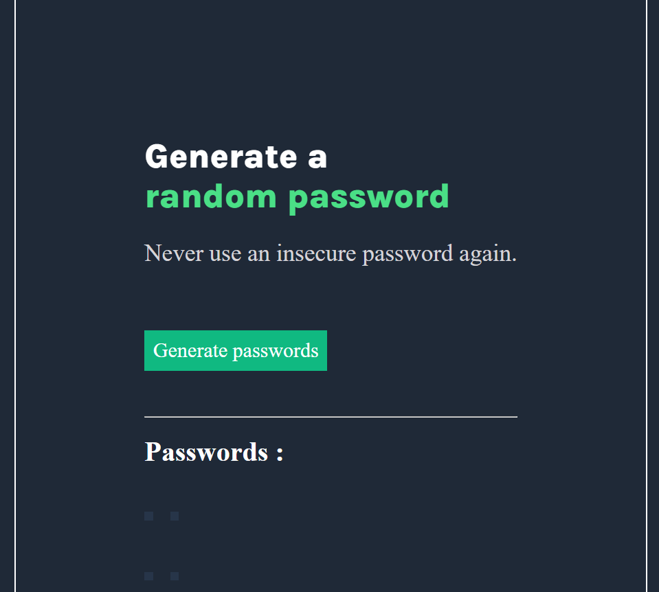
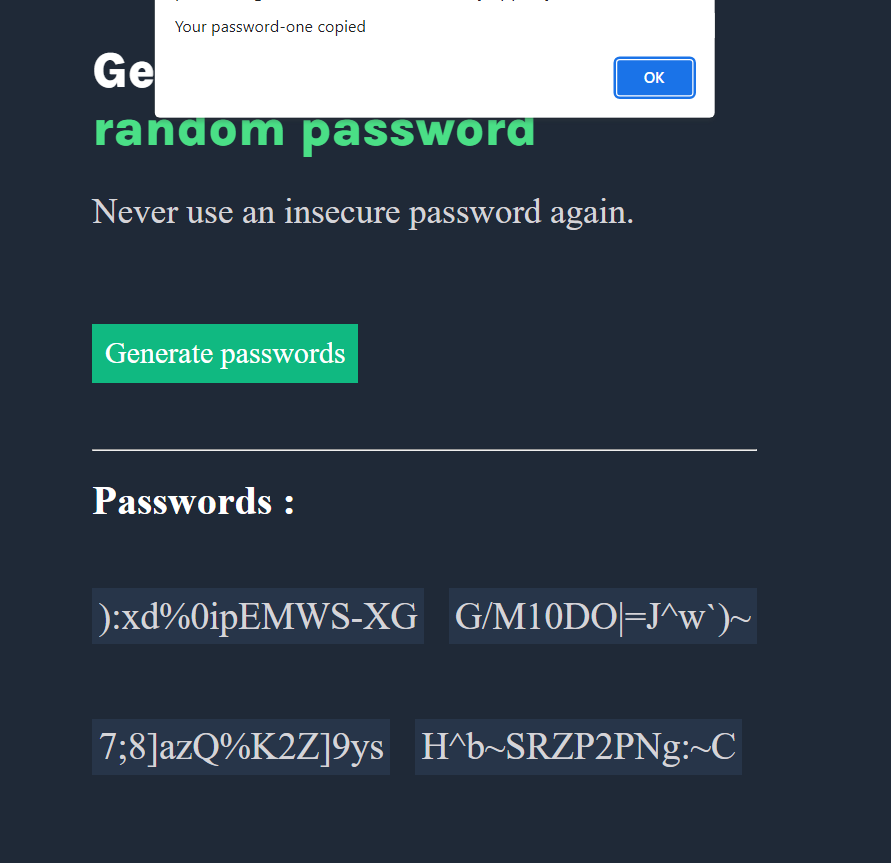

# Password Generator

The Password Generator is a simple and user-friendly web-based tool that allows you to generate strong and random passwords with just a click. This tool is designed to enhance your online security by providing you with robust passwords that are difficult to crack. Additionally, a new feature has been added where you can easily copy the generated password to your clipboard with a popup message.

## Features

- Generates a random password of 15 characters.
- Ensures password strength with a mix of uppercase letters, lowercase letters, numbers, and special symbols.
- New feature: Copy password to clipboard with a popup message for easy use.
- User-friendly interface that makes password generation quick and hassle-free.

## How to Use

1. Open the Password Generator in your web browser.
2. Click the "Generate Passwords" button.
3. 4 strong and random password of 15 characters will be displayed in the designated areas.
4. To use the new copy-to-clipboard feature:
   - Click on any of the four passwords displayed.
   - A popup message will confirm that the password has been copied to your clipboard.

## Preview

## Technologies Used

- HTML: For the structure and layout of the web page.
- CSS: For styling and visual enhancements.
- JavaScript: For generating random passwords and implementing the copy-to-clipboard feature.

## Future Improvements

- Allow users to customize password length and character types.
- Implement an option to save generated passwords securely.
- Add the ability to generate multiple passwords in one go.
- Enhance the visual design and user experience.

## Acknowledgments

The Password Generator tool was developed by Divv Saxena.

## License

This project is licensed under the [MIT License](LICENSE).

---

Feel free to contribute to this project by submitting pull requests or suggesting improvements. If you encounter any issues or have ideas for new features, please create an issue in the repository. Your feedback is highly appreciated!

For more information, contact [saxenadivv@gmail.com].

Last updated: [15/08/2023]
